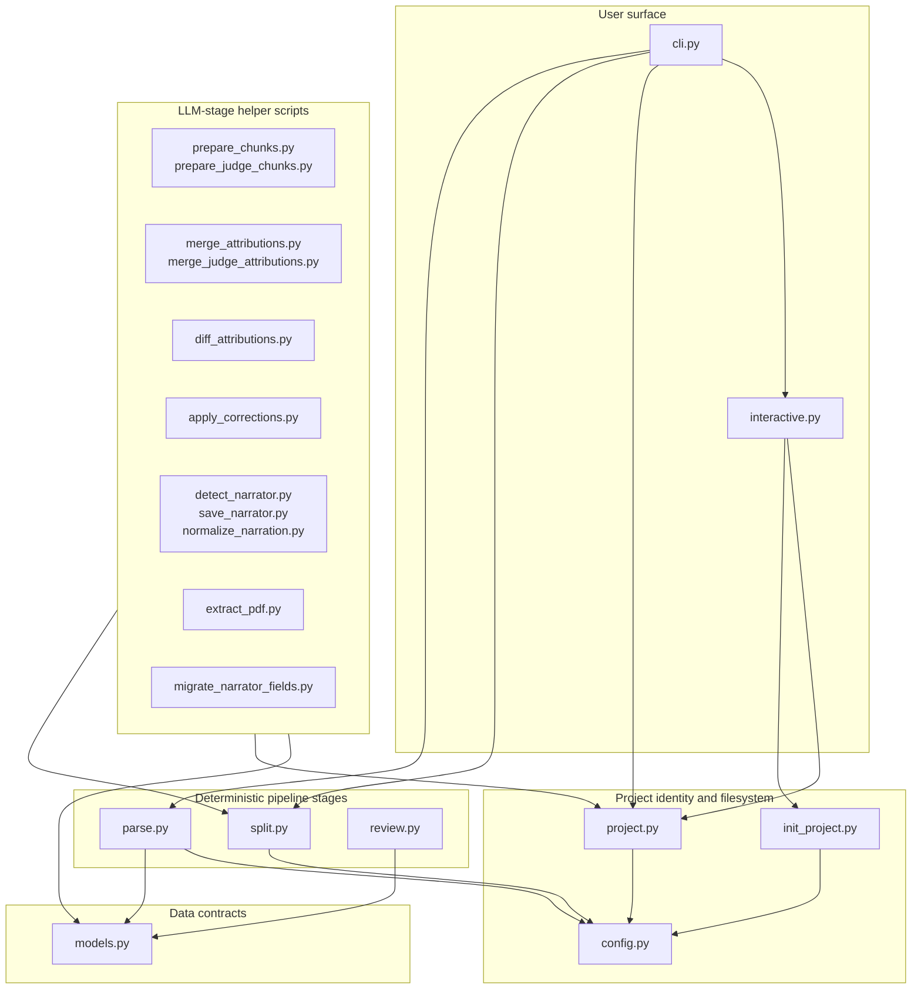

# LN Voice-Over Architecture

This handbook is the curated map of `automations/ln_voice_over/`. It explains the code organization, the data-flow contracts, and the documentation-level module interfaces that humans and LLM agents should read before opening whole modules.

For exhaustive generated facts, use:

- [generated/lnvo-imports.mmd](generated/lnvo-imports.mmd) for the first-party import graph.
- [generated/lnvo-symbols.md](generated/lnvo-symbols.md) for public classes, functions, paths, and line numbers.
- [generated/lnvo-test-map.md](generated/lnvo-test-map.md) for source-module to test-file coverage.

Regenerate those facts with:

```bash
uv run --locked python scripts/generate_architecture_docs.py \
    --source automations/ln_voice_over \
    --tests tests/automations/ln_voice_over \
    --output automations/ln_voice_over/docs/generated \
    --module-prefix automations.ln_voice_over \
    --name lnvo
```

## Scope

LN Voice-Over currently turns one light novel Volume into reviewed, speaker-attributed JSON. The implemented pipeline ends at `reviewed/chapter_NN[_M].json`. Voice mapping and synthesis are planned downstream contracts in [../CONTEXT.md](../CONTEXT.md) and the ADRs, not active CLI stages yet.

This project is an automation, not a public library API. "Interface" in this document means a documentation contract: what a module owns, what it reads and writes, what invariants it protects, and what another agent should know before editing it. It does not mean a new Python interface layer.

## System View

```mermaid
flowchart LR
  AnyFlip["AnyFlip / manual TXT"] --> SourceSkill["/setup-book or source file"]
  SourceSkill --> Source["source/book.json or source/*.txt"]

  Source --> Split["SPLIT\nsplit.py"]
  Split --> Chapters["chapters/*.txt\nchapters/manifest.json"]

  Chapters --> Parse["PARSE\nparse.py"]
  Parse --> Parsed["parsed/chapter_NN[_M].json"]

  Parsed --> Attribution["EXTRACT\n/attribute-speakers + scripts"]
  Chapters --> Attribution
  Attribution --> Extracted["extracted/chapter_NN[_M]/*.json"]

  Parsed --> ReviewSkill["REVIEW\n/review-attribution + review.py"]
  Extracted --> ReviewSkill
  SeriesConfig["series config\ncharacters.json"] --> ReviewSkill
  ReviewSkill --> Reviewed["reviewed/chapter_NN[_M].json"]

  SeriesConfig -. planned .-> VoiceMap["voice_mapping.json"]
  Reviewed -. planned .-> Synthesis["future synthesis"]
  VoiceMap -. planned .-> Synthesis
```



The stable spine is SOURCE -> SPLIT -> PARSE -> EXTRACT -> REVIEW. Each stage writes inspectable text or JSON under the Volume directory. LLM work is isolated to source OCR/structuring, narrator detection, speaker attribution, and disagreement resolution; deterministic Python modules do file I/O, validation, and bookkeeping.

## Repository Shape

```text
automations/ln_voice_over/
|-- README.md                 # user-facing pipeline overview
|-- CONTEXT.md                # domain vocabulary and long-term contracts
|-- cli.py                    # Typer command surface
|-- interactive.py            # guided CLI pickers
|-- config.py                 # project roots, directory names, split regexes
|-- project.py                # series/volume resolution and registry loading
|-- init_project.py           # project creation and legacy source migration
|-- models.py                 # Pydantic data contracts
|-- split.py                  # SOURCE -> chapters + manifest
|-- parse.py                  # chapter text -> typed segments
|-- review.py                 # reviewed artifact construction and validation
|-- scripts/                  # deterministic helpers for LLM-backed stages
`-- docs/
    |-- architecture.md       # this curated handbook
    |-- generated/            # deterministic source/test facts
    `-- adr/                  # design decisions that future edits must preserve
```

## Code Organization View



Read the curated diagram first, then use [generated/lnvo-imports.mmd](generated/lnvo-imports.mmd) when you need the exact import edges.

## Data-Flow Contracts

### Project Identity

The canonical user-facing identifier is `<series>/<volume>`, for example `classroom-of-the-elite-year-2/v7`. `project.py` also accepts legacy `<series>-v<N>` and bare `<series>` as compatibility forms; new docs and commands should prefer `<series>/<volume>`.

Series-level data lives under:

```text
~/.assistant/ln_voice_over/projects/<series>/
`-- config/
    `-- characters.json
```

Volume-level pipeline I/O lives under:

```text
~/.assistant/ln_voice_over/projects/<series>/<volume>/
|-- source/
|-- chapters/
|-- parsed/
|-- extracted/
|-- reviewed/
`-- illustrations/
```

### SOURCE

Input is either `source/book.json` from `/setup-book` or a manually prepared `source/*.txt`. `book.json` is the only place where "book" is the preferred word; the pipeline unit remains Volume.

### SPLIT

`split.py` consumes `source/book.json` or `source/*.txt` and writes:

- `chapters/chapter_NN.txt` or `chapters/chapter_NN_M.txt`.
- `chapters/manifest.json`.

Important invariants:

- Front matter before the first chapter can become `chapter_00`.
- Sub-chapters only split when there are at least two bare `N.M` marker lines, with minors exactly `1..N` and a major number that matches the chapter number.
- Each manifest row starts with `narrator_status: "unset"` and `narrator: null`.
- Re-splitting removes stale chapter files before writing the fresh set.

### PARSE

`parse.py` consumes chapter text and manifest metadata, then writes `parsed/chapter_NN[_M].json`.

Important invariants:

- Segment types are `narration`, `dialogue`, `scene_break`, and `chapter_header`.
- Speaker values are intentionally unset after PARSE.
- Cleanup strips page artifacts and watermarks, collapses excessive blanks, and preserves scene breaks.
- Long narration is split at sentence boundaries.
- Inline quoted words inside narration do not become standalone dialogue.

### EXTRACT

The `/attribute-speakers` workflow and helper scripts consume parsed chapters and produce attribution JSON under `extracted/chapter_NN[_M]/`.

Important invariants:

- Attribution JSON is intermediate data and can contain unresolved LLM names.
- Chunk overlap is merged deterministically; earlier chunk results win where overlaps collide.
- Narrator detection writes back to `chapters/manifest.json` through the same accumulate-then-batch registry-gap rule as speaker attribution.
- Open registry gaps are allowed here but must be closed before REVIEW writes canonical data.

### REVIEW

`review.py` and the review helper scripts combine parsed segments, original attributions, judge attributions, corrections, and the Character registry into `reviewed/chapter_NN[_M].json`.

Canonical speaker grammar:

| Segment type | Legal reviewed speaker |
| --- | --- |
| `narration` | `"Narrator"` |
| `chapter_header` | `"Narrator"` |
| `dialogue` | registry-canonical character name or `"Unknown"` |
| `scene_break` | `null` |

Important invariants:

- `reviewed/` is build output. Do not hand-edit it as a fix.
- REVIEW hard-fails before writing if any canonical name cannot resolve to the registry.
- The `"Narrator"` segment token is structural. The chapter's `narrator` field decides which voice fills that role later.
- `scene_break` is the only legal `null` in reviewed data.

## Module Interface Cards

### `cli.py`

**Responsibility:** Presents the Typer CLI and delegates actual work to project resolution, split, and parse modules.

**Entrypoints:** `list_books`, `split`, `parse`.

**Reads:** CLI arguments, existing project folders through `project.py`.

**Writes:** No stage data directly; delegates writes to `split.py` and `parse.py`.

**Depends on:** `interactive.py`, `project.py`, `split.py`, `parse.py`, `init_project.py`.

**Editing rule:** Keep it thin. New pipeline commands should resolve a Volume, call a stage module or script, and keep business logic out of the CLI layer.

**Tests:** No direct test file currently. Exercise through focused command or stage tests when CLI behavior changes.

### `interactive.py`

**Responsibility:** Guided selection of stage, series, volume, and project bootstrap actions.

**Entrypoints:** `bootstrap_project`, `add_volume_to`, `pick_series`, `pick_volume`, `pick_book`, `resolve_book_arg`, `pick_stage`, `interactive_menu`.

**Reads:** Existing project directories via `project.py`; user input through prompts.

**Writes:** Delegates project creation to `init_project.py`.

**Depends on:** `cli.py`, `init_project.py`, `project.py`.

**Editing rule:** Keep picker output canonical as `<series>/<volume>`. Avoid introducing a second project-identity parser here.

**Tests:** No direct test file currently. Prefer small tests around parser/project functions before adding brittle prompt tests.

### `config.py`

**Responsibility:** Central filesystem constants, subdirectory names, and chapter-boundary patterns.

**Entrypoints:** `series_dir`, `volume_dir`, `project_dir`.

**Reads:** No project data; computes paths from constants and slugs.

**Writes:** Nothing.

**Depends on:** No first-party modules.

**Editing rule:** Treat directory names and regex patterns as cross-stage contracts. Changing one usually requires docs, tests, and migration thinking.

**Tests:** Touched indirectly by parse-cleaning tests.

### `project.py`

**Responsibility:** Parse user project identifiers, resolve concrete paths, discover projects, and load the series Character registry.

**Entrypoints:** `ResolvedVolume`, `parse_slug`, `resolve_volume`, `load_characters`, `list_series`, `list_volumes`.

**Reads:** Project directories and `<series>/config/characters.json`.

**Writes:** Nothing.

**Depends on:** `config.py`, `init_project.py`, `models.py`.

**Editing rule:** This is the one place that should understand `<series>/<volume>`, legacy `<series>-v<N>`, and bare `<series>` defaults.

**Tests:** No direct test file currently; changes here should add focused tests because every command depends on resolution semantics.

### `init_project.py`

**Responsibility:** Create series/volume folders and fold legacy `raw/` or `downloads/` source folders into `source/`.

**Entrypoints:** `slugify`, `split_legacy_slug`, `migrate_source_dir`, `create_project`.

**Reads:** Existing project folders and source folders.

**Writes:** Series config placeholder, volume subdirectories, and migrated source files.

**Depends on:** `config.py`, `models.py`.

**Editing rule:** Keep creation idempotent and migration conservative. Do not delete user source material unless a verified migration path already preserves it.

**Tests:** No direct test file currently.

### `models.py`

**Responsibility:** Pydantic contracts for segments, chapters, characters, registry data, and shared enums.

**Entrypoints:** `SegmentType`, `NarratorStatus`, `Segment`, `Chapter`, `Character`, `CharacterRegistry`.

**Reads/Writes:** Model methods perform JSON load/save for canonical shapes.

**Depends on:** No first-party modules.

**Editing rule:** This is the schema center. Any field rename or validation change must be reflected in parser/review docs, scripts, tests, and existing generated data migrations.

**Tests:** Covered by parse and review tests.

### `split.py`

**Responsibility:** Transform Volume source into chapter text files and a manifest.

**Entrypoints:** `chapter_id`, `normalize_chapter_arg`, `split_volume`, `write_manifest`, `find_chapter_boundaries`.

**Reads:** `source/book.json` or `source/*.txt`.

**Writes:** `chapters/chapter_NN[_M].txt`, `chapters/manifest.json`.

**Depends on:** `config.py`.

**Editing rule:** Preserve the `N.M` sub-chapter rule and stale-file cleanup. Manifest changes ripple into parse, attribution, narrator detection, and review scripts.

**Tests:** `tests/automations/ln_voice_over/test_split.py`.

### `parse.py`

**Responsibility:** Clean chapter text and segment it into typed `Chapter` JSON.

**Entrypoints:** `split_long_narration`, `parse_chapter`.

**Reads:** `chapters/*.txt` and manifest metadata.

**Writes:** `parsed/chapter_NN[_M].json` through callers.

**Depends on:** `config.py`, `models.py`.

**Editing rule:** Keep structural parsing deterministic. Speaker attribution belongs downstream; PARSE should not guess speakers.

**Tests:** `tests/automations/ln_voice_over/test_parse.py`, `tests/automations/ln_voice_over/test_parse_cleaning.py`.

### `review.py`

**Responsibility:** Build and validate canonical reviewed Chapter artifacts.

**Entrypoints:** `ReviewValidationError`, `build_reviewed_chapter`, `validate_reviewed_chapter`.

**Reads:** Parsed chapter, attribution corrections, and Character registry data provided by callers.

**Writes:** No files directly; `scripts/apply_corrections.py` writes the reviewed artifact after validation.

**Depends on:** `models.py`.

**Editing rule:** Preserve hard validation at the `reviewed/` boundary. It is the guardrail that makes intermediate LLM messiness acceptable.

**Tests:** `tests/automations/ln_voice_over/test_review.py`.

## Helper Script Interfaces

| Script group | Scripts | Contract |
| --- | --- | --- |
| Source acquisition | `extract_pdf.py` | Convert a PDF into page images and page classifications for `/setup-book`. |
| Narrator detection | `detect_narrator.py`, `save_narrator.py` | Prepare narrator detection context and persist the detected narrator back to the manifest. |
| Attribution chunking | `prepare_chunks.py`, `merge_attributions.py` | Prepare overlapping attribution chunks and merge per-chunk speaker maps. |
| Judge pass | `prepare_judge_chunks.py`, `merge_judge_attributions.py`, `diff_attributions.py` | Prepare shifted-overlap judge chunks, merge judge maps, and report disagreements. |
| Canonical review | `apply_corrections.py` | Apply resolved corrections through `review.py` and write `reviewed/` only after validation. |
| Maintenance | `migrate_narrator_fields.py`, `normalize_narration.py` | Migrate historical narrator fields and repair old narrator-attributed long dialogue artifacts. |

Script modules are operational glue. Keep them runnable as `python -m automations.ln_voice_over.scripts.<name>` and keep reusable contracts in core modules when they become shared.

## Test And Risk Map

Generated coverage facts live in [generated/lnvo-test-map.md](generated/lnvo-test-map.md). The main human-readable risk map is:

| Area | Current tests | Residual risk |
| --- | --- | --- |
| Split boundaries and manifests | `test_split.py` | CLI/project resolution has no direct tests. |
| Parse segmentation and cleanup | `test_parse.py`, `test_parse_cleaning.py` | Header quote handling is a known open ambiguity in `CONTEXT.md`. |
| Review speaker grammar | `test_review.py` | LLM prompt quality is outside deterministic tests. |
| Narrator field migration | `test_migrate_narrator_fields.py` | Other helper scripts are mostly exercised manually through workflows. |
| Project creation and guided UI | None direct | Add tests before changing slug parsing or directory creation semantics. |

## ADR Guardrails

The ADRs are short but load-bearing:

- [adr/0001-accumulate-then-batch-registry-gaps.md](adr/0001-accumulate-then-batch-registry-gaps.md): intermediate files can contain unresolved names; `reviewed/` cannot.
- [adr/0002-voice-mapping-canonical-vs-proposals-throwaway.md](adr/0002-voice-mapping-canonical-vs-proposals-throwaway.md): future synthesis reads only accepted `voice_mapping.json`, never proposals.
- [adr/0003-mode-disambiguation-via-multiple-registry-characters.md](adr/0003-mode-disambiguation-via-multiple-registry-characters.md): voice-relevant character modes are separate registry Characters, not synthesis-time variants.

## Navigation Recipes

When adding or changing a pipeline stage:

1. Read this handbook and [../CONTEXT.md](../CONTEXT.md).
2. Check the generated symbol inventory for exact entrypoints.
3. Start at the stage module, then follow only the dependency edges in the generated import graph.
4. Update the stage contract in this handbook if behavior changes.
5. Add or update focused tests before relying on manual workflow runs.

When an LLM agent needs a fast orientation:

1. Read "Data-Flow Contracts".
2. Read the relevant module interface card.
3. Open the exact module only after the card tells you which boundary you are editing.
4. Use the generated symbol inventory for line-number targeting.

When docs might be stale:

1. Regenerate `docs/generated/`.
2. Compare generated facts against the curated cards.
3. Patch the curated handbook or the stale source doc.
4. Treat generated artifacts as facts and this handbook as interpretation.
